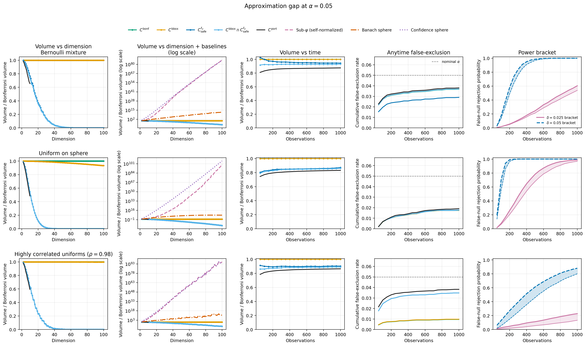
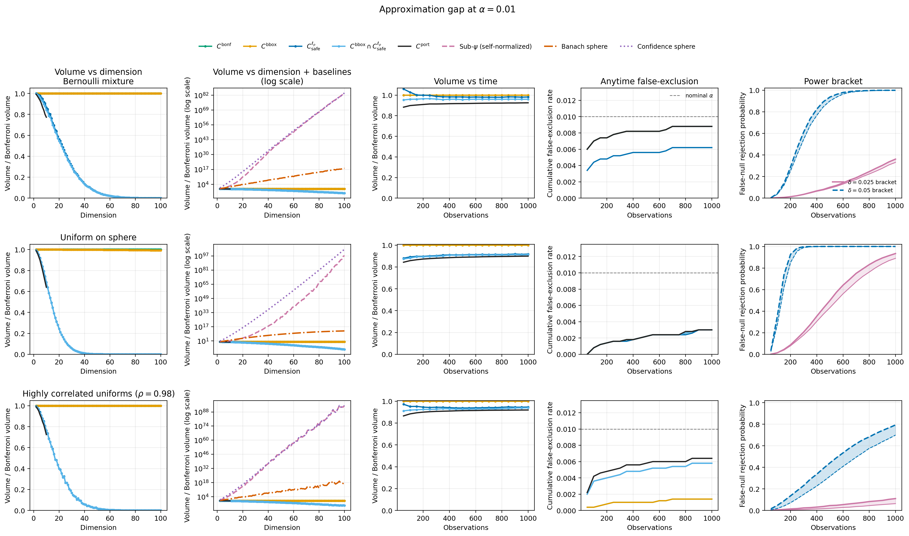
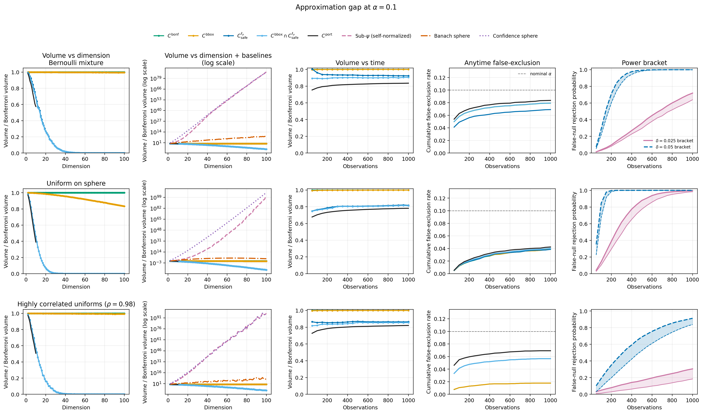

# On the Tightness and Computational Tractability of Higher-Dimensional Confidence Sequences

Paper implementation.

To reproduce the experiments, run:

```
python run_experiments_async.py
```

In the script, set `small_scale=True` to reproduce the small-scale Bounded UP experiment from the appendix. For the experiments from the main text, set `small_scale=False`.

The results will be logged into the `logs` directory. 

- Running `ab_testing.py` (directly from that directory) reproduces the A/B Web Metrics experiment.
- The scripts under `adaptive_sample/conf_sequences/model_comparison` can be run to 1) train the classifiers and 2) evaluate the model comparison experiments.


---

**Additional Experiments for Rebuttal**


Additional experiments/ablations and $\alpha\in \{0.01,0.05,0.10\}$ levels together with included an additional synthetic distribution that has highly correlated coordinates. Its points lie in $[0,1]^D$ with nearly equal coordinates, producing a narrow, Gaussian-like cloud along the main diagonal.

We find that our earlier conclusions, regarding both relative performance to previous methods and the behavior of the approximations, carry over to these setting as well.:


